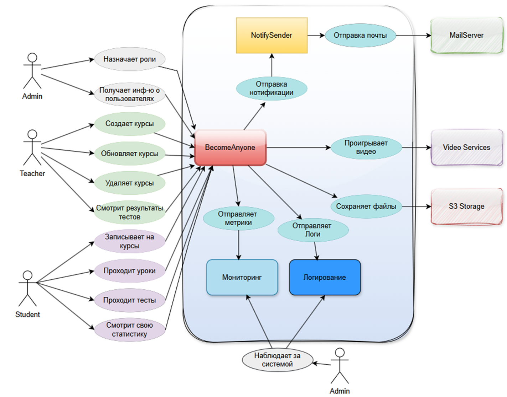
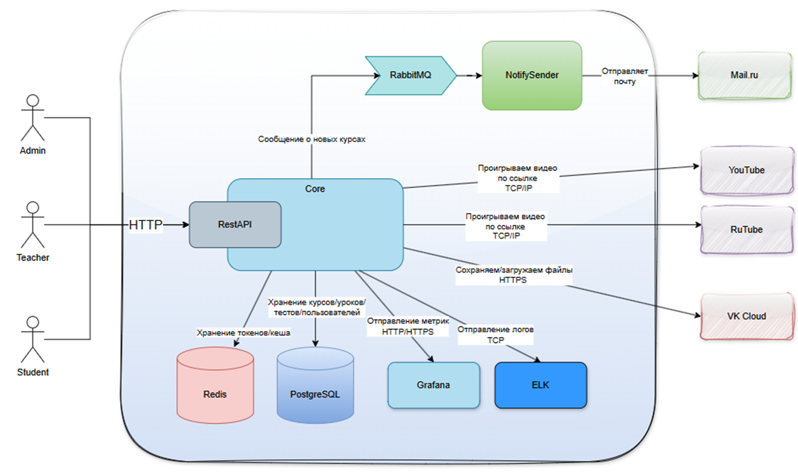
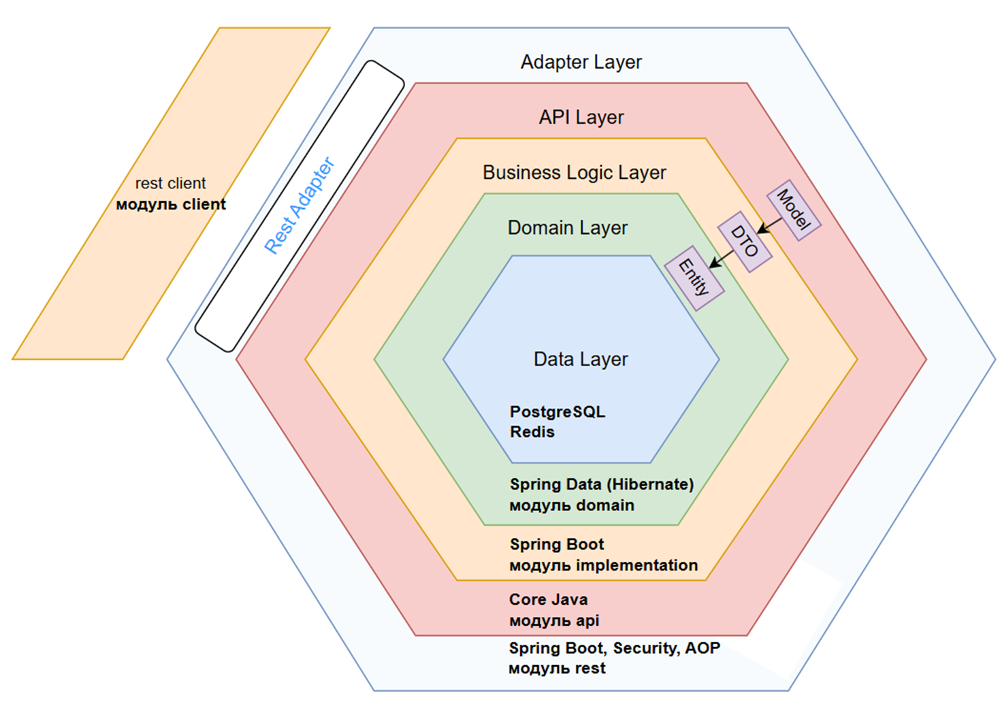
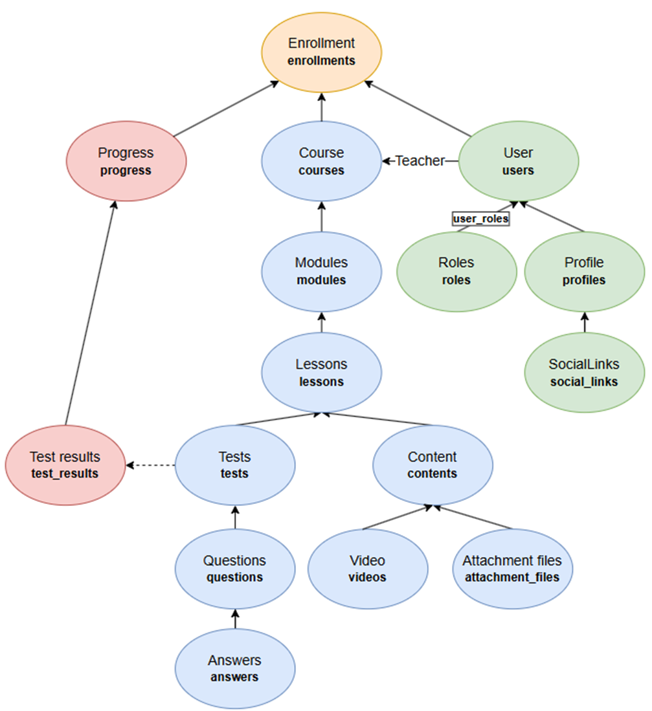
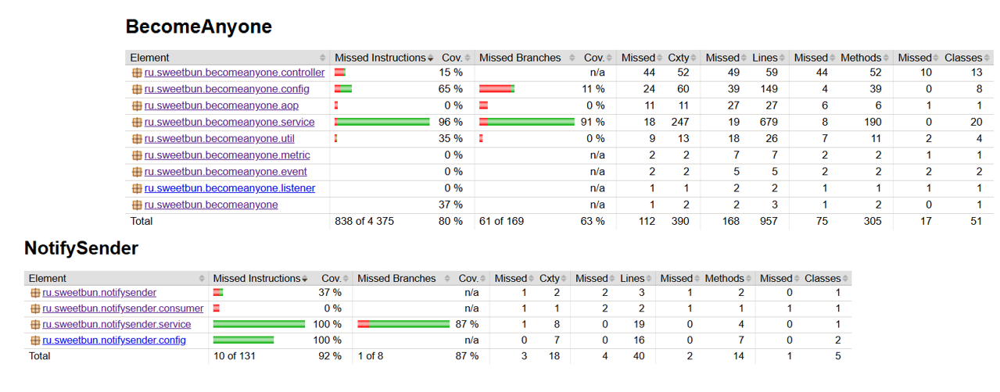
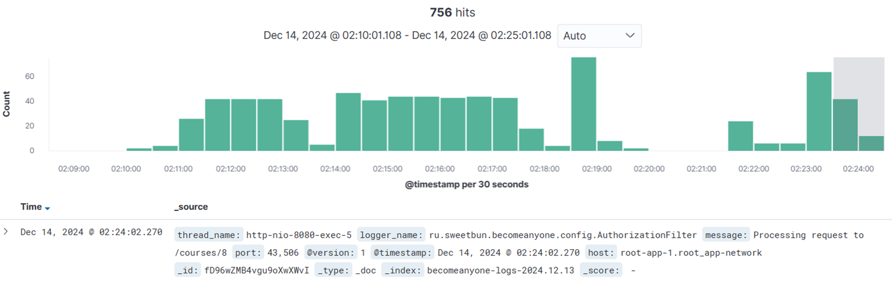
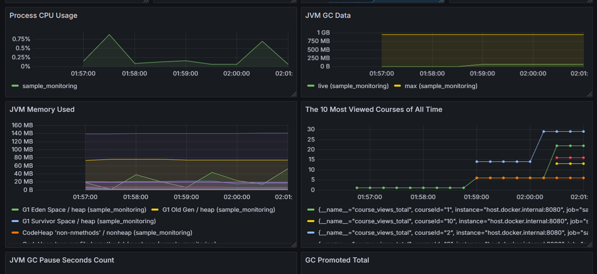

# BecomeAnyone

## Платформа для онлайн-курсов и обучения с возможностью создания и прохождения курсов

# Доступ к приложению и тестовые данные

## Ссылки на приложение и сервисы

| Сервис     | URL                                      | Доступ             |
|------------|------------------------------------------|--------------------|
| **Swagger**| [Swagger UI](http://217.71.129.139:5148/swagger-ui/index.html#/) | Открыт для всех    |
| **RabbitMQ** | [RabbitMQ](http://217.71.129.139:4865/#/) | **username**: `admin`, **password**: `admin` |
| **Kibana** | [Kibana](http://217.71.129.139:5250/app/discover#/) | Открыт для всех    |
| **Grafana**| [Grafana](http://217.71.129.139:5251/dashboards) | **username**: `admin`, **password**: `admin` |

---

## Тестовые данные пользователей

Для тестирования работы приложения доступны следующие учётные данные:

| Роль      | Логин       | Пароль      |
|-----------|-------------|-------------|
| Учитель   | `teacher1`  | `teacher1`  |
| Учитель   | `teacher2`  | `teacher2`  |
| Учитель   | `teacher3`  | `teacher3`  |
| Администратор| `admin`     | `admin`     |

# Основные разделы API

---

## Управление пользователями

| Метод | URL          | Описание                                   | Доступ       |
|-------|--------------|--------------------------------------------|--------------|
| GET   | `/users`     | Получить всех пользователей.              | ADMIN        |
| GET   | `/users/{id}`| Получить профиль пользователя по ID.      | ADMIN, OWNER |

---

## Управление ролями

| Метод | URL                          | Описание                                   | Доступ       |
|-------|------------------------------|--------------------------------------------|--------------|
| PUT   | `/users/{userId}/roles/teacher` | Назначить пользователя учителем.           | ADMIN        |
| PUT   | `/users/{userId}/roles/admin`   | Назначить пользователя админом.            | ADMIN        |

---

## Управление профилем

| Метод | URL         | Описание          | Доступ |
|-------|-------------|-------------------|--------|
| GET   | `/profiles` | Получить профиль. | ALL    |
| POST  | `/profiles` | Создать профиль.  | ALL    |
| PATCH | `/profiles` | Обновить профиль. | ALL    |

---

## Управление курсами

| Метод | URL          | Описание                                                               | Доступ        |
|-------|--------------|------------------------------------------------------------------------|---------------|
| GET   | `/courses`   | Получить список курсов. Доступны фильтры: `teacherId`, `q`, `page`, `pageSize`. | ALL           |
| POST  | `/courses`   | Создать новый курс с модулями.                                         | TEACHER       |
| GET   | `/courses/{id}` | Получить курс по ID.                                                 | ALL           |
| PATCH | `/courses/{id}` | Обновить данные курса.                                              | TEACHER-OWNER |
| DELETE| `/courses/{id}` | Удалить курс по ID.                                                 | TEACHER-OWNER |

---

## Управление модулями

| Метод | URL                                      | Описание                                   | Доступ       |
|-------|------------------------------------------|--------------------------------------------|--------------|
| GET   | `/courses/{courseId}/modules`            | Получить все модули курса.                 | ALL          |
| POST  | `/courses/{courseId}/modules`            | Создать новый модуль для курса.            | TEACHER, ADMIN |
| GET   | `/courses/{courseId}/modules/{id}`       | Получить модуль по ID.                     | ALL          |
| PATCH | `/courses/{courseId}/modules/{id}`       | Обновить модуль по ID.                     | TEACHER, OWNER |
| DELETE| `/courses/{courseId}/modules/{id}`       | Удалить модуль по ID.                      | TEACHER, OWNER |

---

## Управление уроками

| Метод | URL                                                       | Описание                                   | Доступ        |
|-------|-----------------------------------------------------------|--------------------------------------------|---------------|
| GET   | `/courses/{courseId}/modules/{moduleId}/lessons`          | Получить все уроки для модуля.             | ALL           |
| POST  | `/courses/{courseId}/modules/{moduleId}/lessons`          | Создать новый урок в модуле.               | TEACHER-OWNER |
| GET   | `/courses/{courseId}/modules/{moduleId}/lessons/{id}`     | Получить урок по ID.                       | ALL           |
| PATCH | `/courses/{courseId}/modules/{moduleId}/lessons/{id}`     | Обновить урок по ID.                       | TEACHER-OWNER |
| DELETE| `/courses/{courseId}/modules/{moduleId}/lessons/{id}`     | Удалить урок по ID.                        | TEACHER-OWNER |

---

## Управление тестами

| Метод  | URL                                                                          | Описание                      | Доступ        |
|--------|------------------------------------------------------------------------------|-------------------------------|---------------|
| GET    | `/courses/{courseId}/modules/{moduleId}/lessons/{lessonId}/tests`            | Получить все тесты для урока. | ALL           |
| POST   | `/courses/{courseId}/modules/{moduleId}/lessons/{lessonId}/tests`            | Создать новый тест для урока. | TEACHER-OWNER |
| GET    | `/courses/{courseId}/modules/{moduleId}/lessons/{lessonId}/tests/{id}`       | Получить тест по ID.          | ALL           |
| PATCH  | `/courses/{courseId}/modules/{moduleId}/lessons/{lessonId}/tests/{id}`       | Обновить тест по ID.          | TEACHER-OWNER |
| DELETE | `/courses/{courseId}/modules/{moduleId}/lessons/{lessonId}/tests/{id}`       | Удалить тест по ID.           | TEACHER-OWNER |
| POST   | `/courses/{courseId}/modules/{moduleId}/lessons/{lessonId}/tests/{id}/check` | Проверить тест                | ENROLLED      |

---

## Управление вопросами

| Метод | URL                                                                                  | Описание                                   | Доступ        |
|-------|--------------------------------------------------------------------------------------|--------------------------------------------|---------------|
| GET   | `/courses/{courseId}/modules/{moduleId}/lessons/{lessonId}/tests/{testId}/questions` | Получить все вопросы для теста.            | ALL           |
| POST  | `/courses/{courseId}/modules/{moduleId}/lessons/{lessonId}/tests/{testId}/questions` | Создать новый вопрос для теста.            | TEACHER-OWNER |
| GET   | `/courses/{courseId}/modules/{moduleId}/lessons/{lessonId}/tests/{testId}/questions/{id}` | Получить вопрос по ID.                | ALL           |
| PATCH | `/courses/{courseId}/modules/{moduleId}/lessons/{lessonId}/tests/{testId}/questions/{id}` | Обновить вопрос по ID.                | TEACHER-OWNER |
| DELETE| `/courses/{courseId}/modules/{moduleId}/lessons/{lessonId}/tests/{testId}/questions/{id}` | Удалить вопрос по ID.                 | TEACHER-OWNER |

---

## Управление файлами

| Метод | URL                                                                                  | Описание                                   | Доступ        |
|-------|--------------------------------------------------------------------------------------|--------------------------------------------|---------------|
| POST  | `/courses/{courseId}/modules/{moduleId}/lessons/{lessonId}/files`                    | Добавить файл к уроку.                     | TEACHER-OWNER |
| GET   | `/courses/{courseId}/modules/{moduleId}/lessons/{lessonId}/files/{id}/download-url`  | Получить ссылку для скачивания файла.      | ENROLLED      |
| DELETE| `/courses/{courseId}/modules/{moduleId}/lessons/{lessonId}/files/{id}`               | Удалить файл по ID.                        | TEACHER-OWNER |

---

## Управление регистрацией и авторизацией

| Метод | URL             | Описание                                   | Доступ       |
|-------|-----------------|--------------------------------------------|--------------|
| POST  | `/auth/register`| Регистрация нового пользователя.          | ALL          |
| POST  | `/auth/login`   | Авторизация пользователя.                 | ALL          |
| POST  | `/auth/refresh` | Обновление токена доступа.                | ALL          |
| POST  | `/auth/logout`  | Выход пользователя из системы.            | ALL          |

---

## Управление статистикой

| Метод | URL                   | Описание                           | Доступ |
|-------|-----------------------|------------------------------------|--------|
| GET   | `/profile/statistics` | Получить свою статистику по учебе. | ALL    |

---

## Зачисление на курсы

| Метод | URL                            | Описание                                   | Доступ        |
|-------|--------------------------------|--------------------------------------------|---------------|
| GET   | `/courses/{courseId}/enrollments` | Получить зачисления на курс.              | TEACHER-OWNER |
| POST  | `/courses/{courseId}/enrollments` | Записаться на курс.                       | ALL           |
| DELETE| `/courses/{courseId}/enrollments` | Отчислиться с курса.                      | ALL           |

# Архитектура

## Уровень С1 (Context)

## Уровень С2 (Container)

## Уровень С3 (Component)

# Модель данных

# Стек и технологии

| Назначение         | Технологии                                      |
|--------------------|-------------------------------------------------|
| Core               | Core Java v.21, Spring Boot v.3                |
| БД                 | PostgreSQL, Redis                              |
| ORM                | Hibernate, Spring Data JPA                     |
| Кеширование        | Redis                                          |
| Брокер сообщений   | RabbitMQ                                       |
| Безопасность       | Spring Security, JWT, Spring AOP               |
| S3 Хранилище       | S3 (VK Cloud)                                  |
| Видео-сервисы      | Youtube, Rutube                                |
| Отправка email     | Spring Email                                   |
| Клиент             | Spring Cloud                                   |
| Миграции БД        | Liquibase                                      |
| Тестирование       | JUnit 5, Mockito, Testcontainers, Jacoco       |
| Сборка             | Maven                                          |
| Контейнеризация    | Docker                                         |
| Оркестрация        | Docker Compose                                 |
| Мониторинг         | ELK, Prometheus, Grafana                       |
| Документация и API | Swagger                                        |

# Покрытие тестами

# ELK

# Metrics

